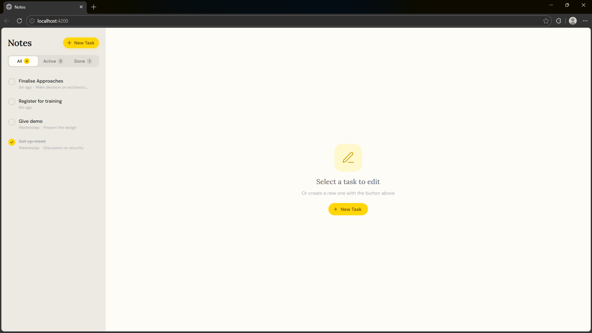

# Notes — Angular To-Do App

A macOS Notes-inspired task manager built with Angular 21.

## Quick Start

```bash
npm install
ng serve
```

Then open [http://localhost:4200](http://localhost:4200)

---

## API Configuration

Open `src/app/todo.service.ts` and update the base URL:

```ts
private readonly API_URL = 'http://localhost:3000/api/todos';
```

---

## Expected REST API Contract

| Method | Endpoint            | Body                              | Returns      |
|--------|---------------------|-----------------------------------|--------------|
| GET    | `/api/todos`        | —                                 | `Todo[]`     |
| POST   | `/api/todos`        | `{ title, note? }`                | `Todo`       |
| PATCH  | `/api/todos/:id`    | `{ title?, note?, completed? }`   | `Todo`       |
| DELETE | `/api/todos/:id`    | —                                 | `204`        |

### Todo Object Shape

```json
{
  "id": 1,
  "title": "Buy groceries",
  "note": "Milk, eggs, bread",
  "completed": false,
  "createdAt": "2025-01-01T10:00:00Z",
  "updatedAt": "2025-01-01T10:00:00Z"
}
```

---

## Features

- **Load all tasks** on page load via GET
- **Create task** via floating ✎ button → bottom sheet modal
- **Edit task** title & note by tapping any task row
- **Mark complete** via the circular checkbox (optimistic update)
- **Delete task** via the trash icon → inline confirmation
- **Filter** by All / Active / Done tabs
- Smooth Angular animations on list/modal transitions
- Skeleton loading state
- Error display in modal on API failure

---

## Project Structure

```
src/
├── app/
│   ├── app.module.ts         # HttpClientModule, FormsModule, Animations
│   ├── app.component.ts      # All state & logic
│   ├── app.component.html    # Template
│   ├── app.component.scss    # iPhone Notes styles
│   └── todo.model.ts         # Todo, CreateTodoDto, UpdateTodoDto interfaces
│   └── todo.service.ts       # REST API calls
├── index.html
├── main.ts
└── styles.scss               # Global CSS variables & animations
```
