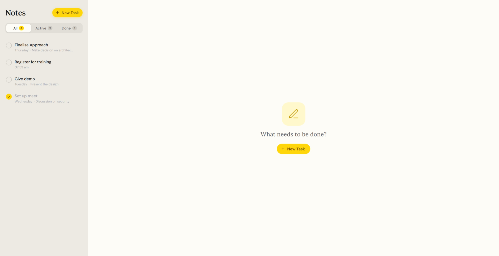

# Notes To-Do

A macOS Notes-inspired task manager — Angular 21 frontend, Spring Boot 3 backend, MySQL database.



---

## Tech Stack

| Layer        | Technology                  |
|--------------|-----------------------------|
| Frontend     | Angular 21 (Standalone)     |
| Backend      | Spring Boot 3.2, Java 21    |
| Persistence  | Spring Data JPA + Hibernate |
| Database     | MySQL 8+                    |
| Validation   | Jakarta Bean Validation     |
| Boilerplate  | Lombok                      |

---

## Project Structure

```
cait_todo/
├── src/
│       ├── app/                      # Angular Frontend
│       │   ├── app.component.ts      # All state & logic (standalone)
│       │   ├── app.component.html    # Template
│       │   ├── app.component.scss    # Notes-inspired styles
│       │   ├── todo.model.ts         # Todo, CreateTodoDto, UpdateTodoDto interfaces
│       │   └── todo.service.ts       # REST API calls
│       ├── index.html
│       ├── main.ts
│       └── styles.scss               # Global CSS variables & animations
│
└── main/java/com/notes/todo/         # Spring Boot Backend
        ├── TodoApplication.java      # Entry point
        ├── config/
        │   └── CorsConfig.java       # CORS filter
        ├── controller/
        │   └── TodoController.java   # REST endpoints
        ├── dto/
        │   ├── CreateTodoDto.java    # POST request body
        │   ├── UpdateTodoDto.java    # PATCH request body
        │   └── TodoResponse.java     # JSON response shape
        ├── entity/
        │   └── Todo.java             # JPA entity / DB table
        ├── exception/
        │   ├── TodoNotFoundException.java
        │   └── GlobalExceptionHandler.java
        ├── repository/
        │   └── TodoRepository.java   # Spring Data interface
        └── service/
            └── TodoService.java      # Business logic
```

---

## Prerequisites

- Node.js 18+ and npm (`node -v`)
- Angular CLI 17+ (`ng version`)
- Java 17 (`java -version`)
- Maven 3.9+ (`mvn -version`)
- MySQL 8+ running locally

---

## Quick Start

Both servers must be running simultaneously. Open two terminals.

### Terminal 1 — Backend

**1. Create the database**

```sql
-- In your MySQL client:
CREATE DATABASE notes_todo CHARACTER SET utf8mb4 COLLATE utf8mb4_unicode_ci;
```

Or run the included script:

```bash
mysql -u root -p < backend/src/main/resources/schema.sql
```

**2. Configure credentials**

Edit `backend/src/main/resources/application.properties`:

```properties
spring.datasource.url=jdbc:mysql://localhost:3306/notes_todo?useSSL=false&serverTimezone=UTC
spring.datasource.username=root
spring.datasource.password=your_password
```

**3. Start the API**

```bash
cd backend
mvn spring-boot:run
```

API is now live at **http://localhost:8080**. Hibernate auto-creates the `todos` table on first boot.

---

### Terminal 2 — Frontend

**1. Install dependencies**

```bash
cd frontend
npm install
```

**2. Start the dev server**

```bash
ng serve
```

App is now live at **http://localhost:4200**.

---

## Features

- **Load all tasks** on page load via `GET /api/todos`
- **Create task** via New Task button → inline editor panel
- **Edit task** title & note by clicking any task row
- **Mark complete** via circular checkbox (optimistic update with rollback)
- **Delete task** via trash icon → inline confirmation
- **Filter** by All / Active / Done tabs
- Skeleton loading state while fetching from API
- Error banner with retry if the API is unreachable
- Saving spinner and disabled inputs during in-flight requests
- Smooth Angular animations on list and panel transitions

---

## API Reference

Base URL: `http://localhost:8080/api/todos`

| Method   | Endpoint          | Body                            | Response         |
|----------|-------------------|---------------------------------|------------------|
| `GET`    | `/api/todos`      | —                               | `200` `Todo[]`   |
| `GET`    | `/api/todos/{id}` | —                               | `200` `Todo`     |
| `POST`   | `/api/todos`      | `{ title, note? }`              | `201` `Todo`     |
| `PATCH`  | `/api/todos/{id}` | `{ title?, note?, completed? }` | `200` `Todo`     |
| `DELETE` | `/api/todos/{id}` | —                               | `204` No Content |

### Todo object shape

```json
{
  "id": 1,
  "title": "Buy groceries",
  "note": "Milk, eggs, bread",
  "completed": false,
  "createdAt": "2025-01-01T10:00:00.000Z",
  "updatedAt": "2025-01-01T10:00:00.000Z"
}
```

### Error response shape

```json
{
  "status": 404,
  "message": "Todo not found with id: 99",
  "timestamp": "2025-01-01T10:00:00Z"
}
```

Validation errors also include a per-field `errors` map:

```json
{
  "status": 400,
  "message": "Title must not be blank",
  "timestamp": "2025-01-01T10:00:00Z",
  "errors": {
    "title": "Title must not be blank"
  }
}
```

---

## CORS

The API allows requests from `http://localhost:4200` by default. To add production origins, update `application.properties`:

```properties
app.cors.allowed-origins=http://localhost:4200,https://your-production-domain.com
```

---

## Configuration Reference

### Frontend — `src/app/todo.service.ts`

```ts
private readonly API_URL = 'http://localhost:8080/api/todos';
```

### Backend — `src/main/resources/application.properties`

```properties
server.port=8080
spring.datasource.url=jdbc:mysql://localhost:3306/notes_todo?useSSL=false&serverTimezone=UTC
spring.datasource.username=root
spring.datasource.password=your_password
spring.jpa.hibernate.ddl-auto=update
app.cors.allowed-origins=http://localhost:4200
```